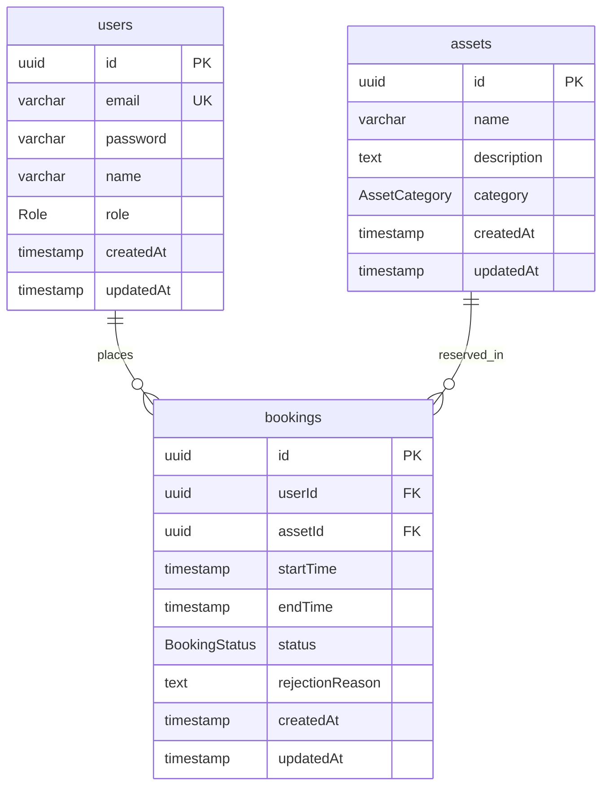

# Database Schema


---

## Enums
```
    Role          : MAHASISWA, ADMIN
    AssetCategory : ROOM, ITEM
    BookingStatus : PENDING, APPROVED, REJECTED, COMPLETED
```
---

## Table: users

| Column    | Type      | Constraint                    |
|-----------|-----------|-------------------------------|
| id        | UUID      | PK, default gen_random_uuid() |
| email     | VARCHAR   | NOT NULL, UNIQUE              |
| password  | VARCHAR   | NOT NULL                      |
| name      | VARCHAR   | NOT NULL                      |
| role      | Role      | NOT NULL, default MAHASISWA   |
| createdAt | TIMESTAMP | NOT NULL, default NOW()       |
| updatedAt | TIMESTAMP | NOT NULL, default NOW()       |

---

## Table: assets

| Column      | Type          | Constraint                    |
|-------------|---------------|-------------------------------|
| id          | UUID          | PK, default gen_random_uuid() |
| name        | VARCHAR       | NOT NULL                      |
| description | TEXT          | NULLABLE                      |
| category    | AssetCategory | NOT NULL                      |
| createdAt   | TIMESTAMP     | NOT NULL, default NOW()       |
| updatedAt   | TIMESTAMP     | NOT NULL, default NOW()       |

---

## Table: bookings

| Column          | Type          | Constraint                                |
|-----------------|---------------|-------------------------------------------|
| id              | UUID          | PK, default gen_random_uuid()             |
| userId          | UUID          | FK → users.id, ON DELETE CASCADE          |
| assetId         | UUID          | FK → assets.id, ON DELETE CASCADE         |
| startTime       | TIMESTAMP     | NOT NULL                                  |
| endTime         | TIMESTAMP     | NOT NULL                                  |
| status          | BookingStatus | NOT NULL, default PENDING                 |
| rejectionReason | TEXT          | NULLABLE, required if status = REJECTED   |
| createdAt       | TIMESTAMP     | NOT NULL, default NOW()                   |
| updatedAt       | TIMESTAMP     | NOT NULL, default NOW()                   |

---

## Relationships

| From     | To       | Type        | Description                      |
|----------|----------|-------------|----------------------------------|
| users    | bookings | One-to-Many | One user can have many bookings  |
| assets   | bookings | One-to-Many | One asset can have many bookings |